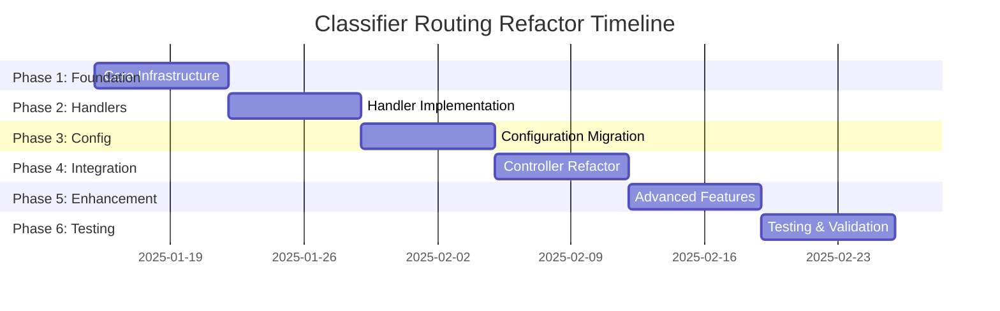

# Issue 2118: Refactor Classifier Routing System Implementation Plan

## Executive Summary

The current classifier routing system in WEBTOYS uses a monolithic decision tree embedded within `controller.ts` and `wtaf-processor.ts` with hardcoded conditional logic scattered throughout the codebase. This implementation plan proposes refactoring to a modular, extensible resolver pattern with registry-based routing that separates concerns and enables easier maintenance and feature additions.

**Timeline Estimate:** 4-6 weeks  
**Risk Level:** High (affects core routing logic)  
**Breaking Changes:** None (backward compatibility maintained)

## Current State Analysis

### Existing Architecture Issues

1. **Monolithic Decision Tree**: The main routing logic in `controller.ts:1583-1595` uses hardcoded keyword detection:
   ```typescript
   const isGameRequest = userPrompt.toLowerCase().includes('game') || 
                        userPrompt.toLowerCase().includes('pong') ||
                        userPrompt.toLowerCase().includes('puzzle');
   ```

2. **Scattered Override Logic**: Override flags (`--admin`, `--zad-test`, etc.) are handled via string concatenation markers in `wtaf-processor.ts:194-255`

3. **Tight Coupling**: Business logic mixed with routing decisions across multiple files:
   - `controller.ts` - Contains routing configuration and override detection
   - `wtaf-processor.ts` - Contains classifier bypassing and smart routing
   - `classifier-builder.ts` - Contains modular classifier assembly
   - `stackables-manager.ts` - Contains stack command parsing

4. **Configuration Fragmentation**: App type configs spread across:
   - `controller.ts` REQUEST_CONFIGS object
   - `content/classification/` JSON files
   - Hard-coded decision trees in multiple files

### Current Request Processing Flow

```
User Request → Override Detection → Game Detection → Config Selection → Classifier → Builder → Output
     ↓              ↓                    ↓               ↓              ↓          ↓        ↓
controller.ts → controller.ts → controller.ts → controller.ts → wtaf-processor → wtaf-processor → storage-manager
```

## Proposed Architecture

### New Resolver Pattern Architecture

```
Request → Route Resolver Registry → Handler → Processor → Output
   ↓            ↓                     ↓          ↓         ↓
  Input    Route Selection     Business Logic  AI Call  Storage
```

### Core Components

1. **Route Registry** - Central registry of all route handlers
2. **Request Resolver** - Determines which handler processes the request
3. **Handler Interface** - Standardized interface for all request handlers
4. **Context Objects** - Immutable request context passed through pipeline
5. **Middleware Pipeline** - Composable processing stages

## Step-by-Step Implementation Tasks

### Phase 1: Foundation (Week 1)

#### 1. Create Core Resolver Infrastructure
- **File:** `sms-bot/engine/routing/resolver-registry.ts`
- **Task:** Create registry system for route handlers
- **Interface:**
  ```typescript
  interface RouteHandler {
    name: string;
    canHandle(context: RequestContext): Promise<boolean>;
    priority: number;
    handle(context: RequestContext): Promise<ProcessingResult>;
  }
  ```

#### 2. Create Request Context System
- **File:** `sms-bot/engine/routing/request-context.ts`
- **Task:** Define immutable context objects
- **Interface:**
  ```typescript
  interface RequestContext {
    readonly userPrompt: string;
    readonly senderPhone: string;
    readonly overrides: CommandOverrides;
    readonly userRole: string;
    readonly coach: string | null;
    readonly metadata: RequestMetadata;
  }
  ```

#### 3. Create Handler Base Classes
- **File:** `sms-bot/engine/routing/base-handler.ts`
- **Task:** Abstract base classes for different handler types
- **Components:**
  - `BaseRouteHandler` - Common handler functionality
  - `ClassifierHandler` - For requests requiring AI classification
  - `DirectHandler` - For requests with direct routing (games, overrides)

### Phase 2: Handler Implementation (Week 2)

#### 4. Implement Game Handler
- **File:** `sms-bot/engine/routing/handlers/game-handler.ts`
- **Task:** Extract game detection and routing logic
- **Migration:** Move logic from `controller.ts:1583-1586`

#### 5. Implement Override Handlers
- **Files:**
  - `sms-bot/engine/routing/handlers/admin-handler.ts`
  - `sms-bot/engine/routing/handlers/stack-handler.ts` 
  - `sms-bot/engine/routing/handlers/zad-override-handler.ts`
- **Task:** Extract override logic from `wtaf-processor.ts:194-255`
- **Migration:** Replace marker-based system with structured routing

#### 6. Implement Classifier Handler
- **File:** `sms-bot/engine/routing/handlers/classifier-handler.ts`
- **Task:** Wrap existing classifier-builder logic in new handler interface
- **Integration:** Connect to `classifier-builder.ts`

#### 7. Implement Standard App Handler
- **File:** `sms-bot/engine/routing/handlers/standard-app-handler.ts`
- **Task:** Default handler for standard web app requests
- **Integration:** Connect to existing builder configurations

### Phase 3: Configuration Migration (Week 3)

#### 8. Centralize Route Configuration
- **File:** `sms-bot/engine/routing/route-config.ts`
- **Task:** Consolidate all routing configuration into single source
- **Migration:** Move from `REQUEST_CONFIGS` object to structured configuration

#### 9. Create Handler Factory
- **File:** `sms-bot/engine/routing/handler-factory.ts`
- **Task:** Factory pattern for creating and configuring handlers
- **Features:**
  - Dynamic handler registration
  - Configuration injection
  - Dependency resolution

#### 10. Implement Route Resolution Algorithm
- **File:** `sms-bot/engine/routing/route-resolver.ts`
- **Task:** Main resolution logic
- **Algorithm:**
  ```typescript
  async resolveRoute(context: RequestContext): Promise<RouteHandler> {
    const candidates = registry.getHandlers()
      .filter(handler => handler.canHandle(context))
      .sort((a, b) => b.priority - a.priority);
    
    return candidates[0] || defaultHandler;
  }
  ```

### Phase 4: Controller Integration (Week 4)

#### 11. Refactor Controller Entry Point
- **File:** `sms-bot/engine/controller.ts`
- **Task:** Replace monolithic routing with resolver system
- **Changes:**
  - Remove hardcoded game detection (lines 1583-1586)
  - Remove direct override handling
  - Add resolver integration
- **New Flow:**
  ```typescript
  const context = createRequestContext(userPrompt, senderPhone, overrides);
  const handler = await routeResolver.resolve(context);
  const result = await handler.handle(context);
  ```

#### 12. Update WTAF Processor Integration
- **File:** `sms-bot/engine/wtaf-processor.ts`
- **Task:** Remove routing logic, focus on AI processing
- **Changes:**
  - Remove smart routing (lines 176-194)
  - Remove override detection (lines 194-255)
  - Keep AI processing and prompt generation

### Phase 5: Enhanced Features (Week 5)

#### 13. Add Route Middleware System
- **File:** `sms-bot/engine/routing/middleware/`
- **Components:**
  - `rate-limit-middleware.ts` - Move rate limiting from controller
  - `validation-middleware.ts` - Request validation
  - `logging-middleware.ts` - Structured request logging
  - `cache-middleware.ts` - Response caching

#### 14. Implement Route Analytics
- **File:** `sms-bot/engine/routing/analytics.ts`
- **Task:** Track routing decisions and handler performance
- **Features:**
  - Route hit counts
  - Handler execution times
  - Error rates by handler

#### 15. Add Dynamic Handler Loading
- **File:** `sms-bot/engine/routing/dynamic-loader.ts`
- **Task:** Enable runtime handler registration
- **Features:**
  - Plugin system for custom handlers
  - Hot reloading during development
  - A/B testing for different routing strategies

### Phase 6: Testing & Validation (Week 6)

#### 16. Create Comprehensive Test Suite
- **Files:**
  - `test/routing/resolver.test.ts`
  - `test/routing/handlers/game-handler.test.ts`
  - `test/routing/handlers/classifier-handler.test.ts`
- **Coverage:** Test all routing scenarios and edge cases

#### 17. Add Integration Tests
- **File:** `test/integration/routing-flow.test.ts`
- **Task:** End-to-end tests for complete request processing

#### 18. Performance Benchmarking
- **File:** `test/performance/routing-benchmark.ts`
- **Task:** Ensure new system performs at least as well as current

## Files and Components Affected

### New Files to Create
```
sms-bot/engine/routing/
├── resolver-registry.ts
├── request-context.ts
├── base-handler.ts
├── route-resolver.ts
├── route-config.ts
├── handler-factory.ts
├── handlers/
│   ├── game-handler.ts
│   ├── admin-handler.ts
│   ├── stack-handler.ts
│   ├── zad-override-handler.ts
│   ├── classifier-handler.ts
│   └── standard-app-handler.ts
├── middleware/
│   ├── rate-limit-middleware.ts
│   ├── validation-middleware.ts
│   ├── logging-middleware.ts
│   └── cache-middleware.ts
└── analytics.ts
```

### Existing Files to Modify
```
sms-bot/engine/
├── controller.ts (Major refactor)
├── wtaf-processor.ts (Remove routing logic)
├── classifier-builder.ts (Interface updates)
├── stackables-manager.ts (Extract to handlers)
└── shared/config.ts (Add routing config)
```

### Configuration Files
```
sms-bot/content/
└── routing/
    ├── handlers.json (Handler configurations)
    └── routes.json (Route definitions)
```

## Testing Strategy

### Unit Testing
- Test each handler in isolation
- Mock dependencies and context objects
- Test edge cases and error conditions
- Coverage target: 90%+

### Integration Testing  
- Test full routing pipeline
- Test handler interactions
- Test middleware execution
- Verify backward compatibility

### Load Testing
- Test resolver performance under load
- Benchmark against current system
- Identify bottlenecks in new architecture

### A/B Testing
- Run both systems in parallel during migration
- Compare routing decisions
- Measure performance differences
- Validate correctness

## Rollback Plan

### Phase-by-Phase Rollback
1. **Registry System Issues**: Revert to hardcoded routing in controller
2. **Handler Issues**: Disable specific handlers, fallback to default
3. **Performance Issues**: Toggle between old and new systems via feature flag
4. **Integration Issues**: Rollback controller changes, keep existing flow

### Safety Measures
- Feature flags for gradual rollout
- Monitoring and alerting for routing failures
- Automatic fallback to previous system on errors
- Complete database backup before deployment

### Emergency Rollback Procedure
```bash
# 1. Disable new routing system
export USE_LEGACY_ROUTING=true

# 2. Restart services
./scripts/restart-services.sh

# 3. Verify functionality
./scripts/test-routing.sh

# 4. If needed, git rollback
git revert [commit-hash]
```

## Risk Assessment

### High Risk Items
- **Controller Refactoring**: Core business logic changes
- **Backward Compatibility**: Existing integrations must work
- **Performance Impact**: New system must not slow down requests

### Medium Risk Items
- **Configuration Migration**: Complex config transformation
- **Handler Dependencies**: Circular dependency issues
- **Error Handling**: Consistent error propagation

### Low Risk Items
- **Analytics Addition**: Optional feature
- **Middleware System**: Incremental enhancement
- **Dynamic Loading**: Advanced feature for future

## Success Criteria

### Functional Requirements
- [ ] All existing routing scenarios work unchanged
- [ ] Override commands function identically
- [ ] Game detection works as before
- [ ] ZAD classification maintains accuracy
- [ ] Stack commands process correctly

### Non-Functional Requirements
- [ ] Request processing time ≤ current system + 10ms
- [ ] Memory usage increase ≤ 20MB
- [ ] 99.9% uptime during migration
- [ ] Zero data loss during transition
- [ ] Complete test coverage (≥90%)

### Quality Requirements
- [ ] Clean separation of concerns
- [ ] Extensible architecture for future features  
- [ ] Comprehensive documentation
- [ ] Monitoring and observability
- [ ] Error handling and logging

## Timeline and Dependencies



## Next Steps

1. **Week 1**: Begin Phase 1 - Create core resolver infrastructure
2. **Stakeholder Review**: Present architecture design for approval
3. **Resource Allocation**: Assign development team members
4. **Environment Setup**: Prepare development and testing environments
5. **Monitoring Setup**: Implement performance baselines before starting

---

*This implementation plan provides a comprehensive roadmap for refactoring the WEBTOYS classifier routing system from a monolithic decision tree to a modern, extensible resolver pattern architecture while maintaining backward compatibility and system reliability.*