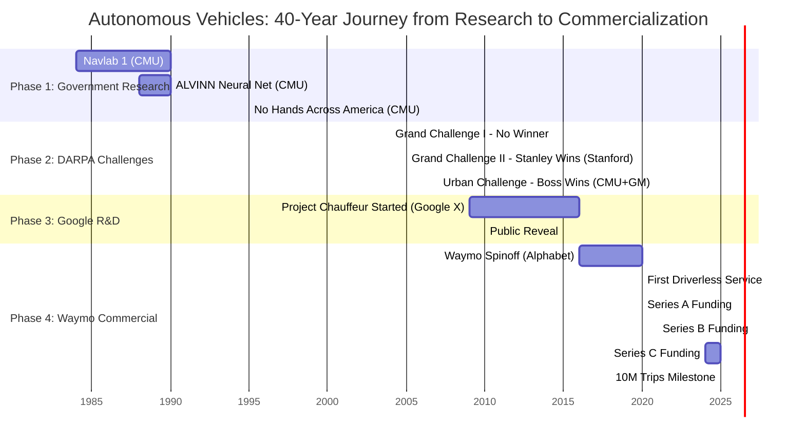

# Autonomous Vehicles Timeline Visualization

## Timeline: From DARPA to Waymo
### What Happened | Where/By Whom | Who Funded It

---

## Mermaid Diagram Version



---

## Detailed Timeline Chart

```
1984-2000: GOVERNMENT-FUNDED ACADEMIC RESEARCH
═══════════════════════════════════════════════════════════════════════════════

Year | What Happened                          | Where/By Whom              | Who Funded It
─────┼────────────────────────────────────────┼────────────────────────────┼──────────────────────
1984 | Autonomous Land Vehicle Project begins | CMU Robotics Institute     | DARPA Strategic Computing
1986 | Navlab 1 - First autonomous van        | CMU - Chevy panel van     | DARPA
1988 | ALVINN Neural Network developed        | CMU - Dean Pomerleau      | DARPA
1990 | Navlab 2 - HMMWV upgrade              | CMU                        | DARPA
1995 | "No Hands Across America"             | CMU - 2,850 miles         | DARPA
     | Pittsburgh to San Diego trip           | Navlab 5 (Pontiac van)    |


2004-2007: DARPA GRAND CHALLENGES
═══════════════════════════════════════════════════════════════════════════════

Year | What Happened                          | Where/By Whom              | Who Funded It
─────┼────────────────────────────────────────┼────────────────────────────┼──────────────────────
2004 | Grand Challenge I                      | 195 teams compete          | DARPA ($1M prize)
     | NO FINISHERS (best: 7.32 miles)       | CMU "Sandstorm" furthest  |
     |                                        |                            |
2005 | Grand Challenge II - BREAKTHROUGH!     | Stanford "Stanley" WINS    | DARPA ($2M prize)
     | 5 vehicles complete 132-mile course    | CMU, Stanford, others     | + Corporate sponsors
     |                                        | Led by Sebastian Thrun     |
     |                                        |                            |
2007 | Urban Challenge                        | CMU+GM "Boss" - 1st       | DARPA ($2M, $1M, $500K)
     | Urban environment with traffic         | Stanford "Junior" - 2nd   | + Track A grants ($1M each)
     |                                        | VT "Victor Tango" - 3rd   | + GM, VW partnerships


2009-2016: GOOGLE'S SECRET PROJECT
═══════════════════════════════════════════════════════════════════════════════

Year | What Happened                          | Where/By Whom              | Who Funded It
─────┼────────────────────────────────────────┼────────────────────────────┼──────────────────────
2009 | Project Chauffeur begins (Jan 17)      | Google X Lab              | Google (internal R&D)
     | Team assembled from DARPA winners      | Led by Sebastian Thrun    | Sergey Brin sponsor
     |                                        | + Anthony Levandowski     |
     |                                        | 15 Stanford engineers     |
     |                                        |                            |
2010 | Public reveal after 2 years testing    | Google X                  | Google
     |                                        | San Francisco Bay Area    |
     |                                        |                            |
2009-| Intensive development & testing        | Google X                  | Google
2015 | Millions of miles driven               | Multiple test cities      | $1.1 billion invested


2016-2020: WAYMO SPINOFF & EARLY COMMERCIAL
═══════════════════════════════════════════════════════════════════════════════

Year | What Happened                          | Where/By Whom              | Who Funded It
─────┼────────────────────────────────────────┼────────────────────────────┼──────────────────────
2016 | Waymo created as Alphabet subsidiary   | Waymo LLC                 | Alphabet (100% owned)
Dec  | "A new way forward in mobility"        | Spun out from Google X    |
     |                                        |                            |
2020 | First DRIVERLESS public service        | Waymo One (Phoenix, AZ)   | Alphabet
Oct  | No safety driver in vehicle            |                            |
     |                                        |                            |
2020 | Series A - First external funding      | Waymo                     | $3.2 billion total:
Mar- | Major validation milestone             |                            | - Silver Lake (lead)
Jul  |                                        |                            | - Canada Pension Plan
     |                                        |                            | - Mubadala (Abu Dhabi)
     |                                        |                            | - Andreessen Horowitz
     |                                        |                            | - Alphabet


2021-2025: SCALING TO COMMERCIAL VIABILITY
═══════════════════════════════════════════════════════════════════════════════

Year | What Happened                          | Where/By Whom              | Who Funded It
─────┼────────────────────────────────────────┼────────────────────────────┼──────────────────────
2021 | Series B funding round                 | Waymo                     | $2.5 billion
Jun  | Technology advancement & team growth   |                            | Existing investors
     |                                        |                            |
2024 | Alphabet multiyear commitment          | Waymo                     | Up to $5 billion
Jul  | Long-term strategic investment         |                            | Alphabet commitment
     |                                        |                            |
2024 | Series C - Massive expansion round     | Waymo                     | $5.6 billion:
Oct  | OVERSUBSCRIBED                         | Operating in 4 cities:    | - Alphabet (lead)
     | Valuation: $45 billion                 | - Phoenix                 | - Fidelity
     | 4 million paid trips in 2024           | - San Francisco           | - Silver Lake
     | 200,000+ weekly rides                  | - Los Angeles             | - Tiger Global
     |                                        | - Limited (other cities)  | - T. Rowe Price
     |                                        |                            | - A16z, Perry Creek
     |                                        |                            |
2024 | Revenue milestone                      | Waymo One                 | Customer revenue!
     | $125 million in annual revenue         | 500+ sq miles coverage    | ($57M SF, $45M Phoenix)
     | 2,000 vehicle fleet                    |                            |
     |                                        |                            |
2025 | 10 MILLION trips milestone             | Waymo                     | Operations + investors
May  | 250,000 weekly rides                   | Expanding to:             | Alphabet ongoing support
     | Projected $1.3B revenue by 2027        | - Austin (via Uber)       |
     |                                        | - Atlanta (via Uber)      |
     |                                        | - Miami (2026)            |


═══════════════════════════════════════════════════════════════════════════════
CUMULATIVE INVESTMENT SUMMARY
═══════════════════════════════════════════════════════════════════════════════

Phase                           | Duration  | Primary Funder        | Investment
────────────────────────────────┼───────────┼───────────────────────┼──────────────────
Government Research (DARPA)     | 1984-2007 | DARPA, NSF           | ~$50-100 million
Google Internal R&D             | 2009-2016 | Google/Alphabet      | $1.1+ billion
Waymo (Alphabet only)           | 2016-2020 | Alphabet             | ~$20 billion (est.)
Waymo External Funding          | 2020-2024 | VCs + Alphabet       | $11+ billion
Alphabet Ongoing Commitment     | 2024+     | Alphabet             | $5+ billion committed

TOTAL ESTIMATED INVESTMENT: $40+ BILLION over 40+ years (1984-2025)

═══════════════════════════════════════════════════════════════════════════════
KEY INSIGHTS
═══════════════════════════════════════════════════════════════════════════════

TIME TO MARKET:  40 years from DARPA funding to commercial operations
                 36 years from first Navlab (1986) to driverless service (2020)
                 11 years from Google start (2009) to commercial service (2020)

FUNDING SEQUENCE: Government → Corporate R&D → Hybrid (Corporate + VC)

TALENT PIPELINE:  DARPA Challenge winners → Google → Waymo → Industry dispersion

CAPITAL INTENSITY: $40B+ total, with 75% deployed in final 15 years (2009-2024)

REVENUE TIMELINE:  Year 40 (2024): $125M revenue - still not profitable
                   Year 43 (2027): Projected $1.3B revenue
```

---

## Visual Timeline (Simplified)

```
                    AUTONOMOUS VEHICLES: 40-YEAR TIMELINE
                    ═══════════════════════════════════════

1984 ━━━━━━━━━━━━━━━━━━┓
                       ┃  PHASE 1: GOVERNMENT RESEARCH
1986  Navlab 1         ┃  WHO: Carnegie Mellon University
      (CMU)            ┃  FUNDED BY: DARPA Strategic Computing Initiative
1988  ALVINN           ┃  INVESTMENT: ~$50-100M over 20+ years
      Neural Net       ┃
1995  No Hands         ┃
      Across America   ┃
2004 ━━━━━━━━━━━━━━━━━━┛

2004 ━━━━━━━━━━━━━━━━━━┓
      Grand Challenge   ┃  PHASE 2: COMPETITIVE ACCELERATION
      I (no winner)    ┃  WHO: Universities + Corporate Partners
2005  Stanley WINS!    ┃       Stanford (Thrun), CMU, others
      (Stanford)       ┃  FUNDED BY: DARPA Prizes ($1-2M each)
2007  Boss WINS!       ┃             + Corporate sponsors (GM, VW)
      (CMU + GM)       ┃             + Track A grants ($1M per team)
2009 ━━━━━━━━━━━━━━━━━━┛  INVESTMENT: ~$20M in prizes + corporate support

2009 ━━━━━━━━━━━━━━━━━━┓
Jan   Project          ┃  PHASE 3: CORPORATE R&D
      Chauffeur        ┃  WHO: Google X Lab
      Begins           ┃       Sebastian Thrun + Stanford team (15 engineers)
2010  Public Reveal    ┃  FUNDED BY: Google internal R&D budget
                       ┃  INVESTMENT: $1.1 billion (2009-2015)
                       ┃              ~$30B total Alphabet investment
2016 ━━━━━━━━━━━━━━━━━━┛

2016 ━━━━━━━━━━━━━━━━━━┓
Dec   Waymo Spinoff    ┃  PHASE 4: COMMERCIALIZATION
                       ┃  WHO: Waymo LLC (Alphabet subsidiary)
2020  First Driverless ┃  FUNDED BY: Alphabet + External Investors
Oct   Service          ┃
2020  Series A         ┃  Series A (2020): $3.2B
Mar   $3.2B            ┃    • Silver Lake, Canada Pension, Mubadala, A16z
2021  Series B         ┃  Series B (2021): $2.5B
Jun   $2.5B            ┃    • Existing investors
2024  Alphabet         ┃  Alphabet (2024): $5B commitment
Jul   Commits $5B      ┃  Series C (2024): $5.6B
2024  Series C         ┃    • Alphabet (lead), Fidelity, Silver Lake, Tiger Global
Oct   $5.6B            ┃
      $45B Valuation   ┃  TOTAL EXTERNAL: $11+ billion
2024  $125M Revenue    ┃  TOTAL ALPHABET: ~$30 billion
      4M paid trips    ┃
2025  10M Trips        ┃  INVESTMENT: $40+ billion cumulative (1984-2025)
May   250K weekly      ┃  CURRENT: 2,000 vehicles, 4 cities, 500+ sq miles
2025 ━━━━━━━━━━━━━━━━━━┛  PROJECTION: $1.3B revenue by 2027


                    KEY MILESTONES & FUNDING SOURCES
                    ═════════════════════════════════

┌──────────┬────────────┬─────────────────────┬────────────────┐
│   YEAR   │    WHAT    │     WHERE/WHO       │  FUNDED BY     │
├──────────┼────────────┼─────────────────────┼────────────────┤
│   1984   │  Research  │  CMU Robotics Lab   │  DARPA         │
│   2005   │  Stanley   │  Stanford (Thrun)   │  DARPA + VW    │
│   2009   │  Google X  │  Thrun + 15 team    │  Google        │
│   2016   │  Spinoff   │  Waymo LLC          │  Alphabet      │
│   2020   │  No Driver │  Phoenix, AZ        │  Alphabet      │
│   2024   │  Scale     │  4 cities, 2K cars  │  Alphabet + VC │
│   2027   │  Profit?   │  Projected $1.3B    │  Revenue!      │
└──────────┴────────────┴─────────────────────┴────────────────┘


FUNDING EVOLUTION: DARPA → Google → Alphabet + Venture Capital → Revenue
```

---

## Python Visualization Script

Save this as `generate_timeline.py` and run with Python:

```python
import matplotlib.pyplot as plt
import matplotlib.patches as mpatches
from matplotlib.patches import FancyBboxPatch
import numpy as np

# Create figure
fig, ax = plt.subplots(figsize=(16, 12))
ax.set_xlim(1980, 2028)
ax.set_ylim(0, 10)

# Define colors for funding sources
colors = {
    'DARPA': '#FF6B6B',
    'Google': '#4ECDC4',
    'Alphabet': '#45B7D1',
    'External VC': '#96CEB4',
    'Hybrid': '#FFEAA7',
    'Revenue': '#55E6C1'
}

# Timeline events
events = [
    # Phase 1: Government Research (1984-2004)
    {'year': 1984, 'what': 'Navlab Project Begins', 'who': 'CMU Robotics Institute', 'funder': 'DARPA', 'y': 8},
    {'year': 1986, 'what': 'Navlab 1 (First Van)', 'who': 'CMU - Chevy Van', 'funder': 'DARPA', 'y': 8},
    {'year': 1988, 'what': 'ALVINN Neural Network', 'who': 'CMU - Dean Pomerleau', 'funder': 'DARPA', 'y': 8},
    {'year': 1995, 'what': 'No Hands Across America\n2,850 miles autonomous', 'who': 'CMU Navlab 5', 'funder': 'DARPA', 'y': 8},

    # Phase 2: DARPA Challenges (2004-2007)
    {'year': 2004, 'what': 'Grand Challenge I\nNo Finishers', 'who': '195 Teams, CMU Furthest', 'funder': 'DARPA', 'y': 6.5},
    {'year': 2005, 'what': 'Grand Challenge II\nSTANLEY WINS!', 'who': 'Stanford (Sebastian Thrun)', 'funder': 'DARPA', 'y': 6.5},
    {'year': 2007, 'what': 'Urban Challenge\nBOSS WINS!', 'who': 'CMU + GM Partnership', 'funder': 'DARPA', 'y': 6.5},

    # Phase 3: Google R&D (2009-2016)
    {'year': 2009, 'what': 'Project Chauffeur Begins', 'who': 'Google X (Thrun + 15 engineers)', 'funder': 'Google', 'y': 5},
    {'year': 2010, 'what': 'Public Reveal', 'who': 'Google X', 'funder': 'Google', 'y': 5},

    # Phase 4: Waymo (2016-2025)
    {'year': 2016, 'what': 'Waymo Spinoff', 'who': 'Alphabet Subsidiary', 'funder': 'Alphabet', 'y': 3.5},
    {'year': 2020, 'what': 'First Driverless Service\n+ Series A: $3.2B', 'who': 'Waymo One (Phoenix)', 'funder': 'Hybrid', 'y': 3.5},
    {'year': 2021, 'what': 'Series B: $2.5B', 'who': 'Waymo', 'funder': 'Hybrid', 'y': 3.5},
    {'year': 2024, 'what': 'Series C: $5.6B\n$45B Valuation\n4M Paid Trips', 'who': 'Waymo (4 cities, 2K cars)', 'funder': 'Hybrid', 'y': 3.5},
    {'year': 2025, 'what': '10M Trips\n$125M Revenue', 'who': 'Waymo', 'funder': 'Revenue', 'y': 3.5},
]

# Phase backgrounds
phases = [
    {'start': 1984, 'end': 2004, 'name': 'PHASE 1:\nGovernment Research\n~$50-100M', 'y': 7.5, 'color': '#FFE5E5'},
    {'start': 2004, 'end': 2009, 'name': 'PHASE 2:\nDARPA Challenges\n~$20M', 'y': 6, 'color': '#FFE5F0'},
    {'start': 2009, 'end': 2016, 'name': 'PHASE 3:\nGoogle R&D\n$1.1B+', 'y': 4.5, 'color': '#E5F9F7'},
    {'start': 2016, 'end': 2027, 'name': 'PHASE 4:\nWaymo Commercial\n$30B+ (Alphabet)\n$11B+ (External)', 'y': 3, 'color': '#E5F4FF'},
]

# Draw phase backgrounds
for phase in phases:
    rect = FancyBboxPatch((phase['start'], phase['y']-0.4),
                          phase['end']-phase['start'], 0.8,
                          boxstyle="round,pad=0.05",
                          facecolor=phase['color'],
                          edgecolor='gray',
                          linewidth=1.5,
                          alpha=0.3)
    ax.add_patch(rect)
    ax.text(phase['start'] + (phase['end']-phase['start'])/2, phase['y'],
            phase['name'],
            ha='center', va='center',
            fontsize=9, fontweight='bold',
            bbox=dict(boxstyle='round', facecolor='white', alpha=0.7))

# Plot events
for event in events:
    color = colors[event['funder']]

    # Event marker
    ax.plot(event['year'], event['y'], 'o', markersize=12, color=color,
            markeredgecolor='black', markeredgewidth=1.5, zorder=5)

    # What happened (bold)
    ax.text(event['year'], event['y'] + 0.35, event['what'],
            ha='center', va='bottom', fontsize=8, fontweight='bold',
            bbox=dict(boxstyle='round,pad=0.3', facecolor='white', edgecolor=color, linewidth=2))

    # Who (normal)
    ax.text(event['year'], event['y'] - 0.25, event['who'],
            ha='center', va='top', fontsize=7, style='italic',
            bbox=dict(boxstyle='round,pad=0.2', facecolor='lightyellow', alpha=0.8))

# Draw timeline spine
ax.plot([1984, 2027], [2, 2], 'k-', linewidth=3, zorder=1)

# Year markers
for year in range(1985, 2028, 5):
    ax.plot([year, year], [1.9, 2.1], 'k-', linewidth=2)
    ax.text(year, 1.6, str(year), ha='center', fontsize=10, fontweight='bold')

# Title and labels
ax.text(2005.5, 9.5, 'AUTONOMOUS VEHICLES: 40-YEAR TIMELINE',
        ha='center', fontsize=16, fontweight='bold')
ax.text(2005.5, 9.1, 'From DARPA Research to Waymo Commercialization',
        ha='center', fontsize=12, style='italic')

# Legend for funding sources
legend_elements = [mpatches.Patch(facecolor=colors[key], edgecolor='black', label=key)
                   for key in colors.keys()]
ax.legend(handles=legend_elements, loc='lower left', fontsize=10, title='Funding Source')

# Investment summary box
summary_text = '''TOTAL INVESTMENT: $40+ BILLION (1984-2025)

DARPA (1984-2007):        ~$100M
Google (2009-2016):       $1.1B
Alphabet (2016-2025):     ~$30B
External VC (2020-2024):  $11B

TIME TO MARKET: 40 years
Revenue (2024): $125M (Year 40)'''

ax.text(2027.5, 1, summary_text,
        ha='left', va='bottom', fontsize=8,
        bbox=dict(boxstyle='round,pad=0.5', facecolor='lightyellow', edgecolor='black', linewidth=2),
        family='monospace')

# Remove axes
ax.set_xticks([])
ax.set_yticks([])
ax.spines['top'].set_visible(False)
ax.spines['right'].set_visible(False)
ax.spines['bottom'].set_visible(False)
ax.spines['left'].set_visible(False)

plt.tight_layout()
plt.savefig('autonomous-vehicles-timeline.png', dpi=300, bbox_inches='tight')
print("Timeline saved as 'autonomous-vehicles-timeline.png'")
plt.show()
```

---

## How to Use These Visualizations

### Mermaid Diagram
- Copy the mermaid code block
- Paste into GitHub markdown files (renders automatically)
- Or use https://mermaid.live to view/export

### Text Timeline
- Already formatted and ready to view in this markdown file
- Copy/paste into presentations or documents
- Print-friendly

### Python Script
1. Save as `generate_timeline.py`
2. Install matplotlib: `pip install matplotlib numpy`
3. Run: `python generate_timeline.py`
4. Opens window with chart + saves PNG file

---

_Created: 2025-11-04_
