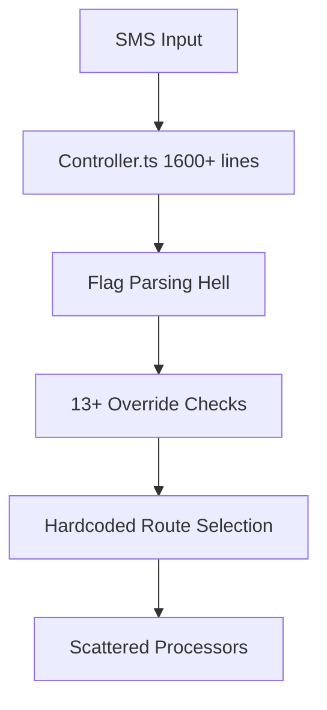
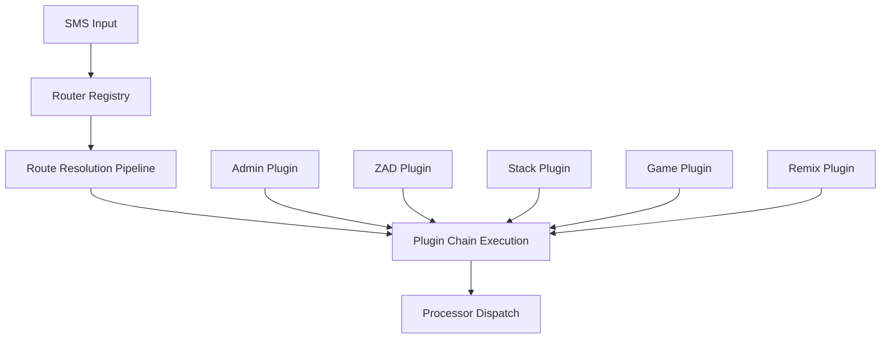

# Implementation Plan: Classifier Routing System Refactor

**Issue**: #2134 - Refactor the entire classifier routing system to use a new architecture  
**Priority**: High  
**Complexity**: System-wide architectural change  
**Timeline**: 2-3 weeks  

## Executive Summary

The current classifier routing system has evolved into a tangled web of hardcoded flags, override mechanisms, and procedural logic scattered throughout the controller. This refactor will replace it with a clean, modular, plugin-based routing architecture that's maintainable, testable, and extensible.

## Current State Analysis

### Architectural Pain Points

1. **Massive Controller Bloat**: `controller.ts` contains 1600+ lines with hardcoded flag parsing (`--admin`, `--zad-test`, etc.)
2. **Scattered Logic**: Routing decisions are mixed with business logic throughout the main processing flow
3. **No Separation of Concerns**: Classification, routing, and processing are tightly coupled
4. **Fragile Override System**: 13+ different flags (`--stackdb`, `--stackzad`, `--remix`, etc.) with complex interactions
5. **Testing Nightmare**: Monolithic structure makes unit testing nearly impossible
6. **Code Duplication**: Similar flag parsing and cleaning logic repeated throughout

### Current Flow Problems



**Current Issues:**
- Linear flag checking with complex precedence rules
- No composability (can't combine certain flags)
- Hardcoded routing logic in `controller.ts:420-1650`
- Override flags scattered across processor interfaces
- No plugin system for new routing types

## Proposed Architecture

### New Modular Plugin System



### Core Components

1. **RouterRegistry**: Central registration system for all route plugins
2. **RouteResolver**: Handles route selection and precedence
3. **RoutePlugin Interface**: Standardized plugin contract
4. **ProcessorDispatcher**: Clean processor orchestration
5. **ConfigManager**: Centralized configuration system

## Implementation Plan

### Phase 1: Foundation (Week 1)

#### Task 1.1: Create Router Core Infrastructure
**Files**: `engine/routing/router-registry.ts`

```typescript
interface RoutePlugin {
  name: string;
  priority: number;
  canHandle(context: RouteContext): boolean;
  extractConfig(context: RouteContext): RouteConfig;
  process(config: RouteConfig): Promise<ProcessorResult>;
}
```

- [ ] Define `RoutePlugin` interface
- [ ] Create `RouterRegistry` class with plugin registration
- [ ] Implement `RouteContext` data structure
- [ ] Add plugin priority resolution system

#### Task 1.2: Create Route Context System
**Files**: `engine/routing/route-context.ts`

```typescript
interface RouteContext {
  userPrompt: string;
  phone: string;
  userRole?: string;
  flags: RouteFlag[];
  metadata: Record<string, any>;
}
```

- [ ] Design `RouteContext` interface
- [ ] Create flag parser (`--admin` → `RouteFlag`)
- [ ] Add context validation
- [ ] Implement context transformation utilities

#### Task 1.3: Build Route Resolver
**Files**: `engine/routing/route-resolver.ts`

- [ ] Create plugin selection algorithm
- [ ] Implement precedence rules (Admin > ZAD > Stack > Default)
- [ ] Add conflict detection and resolution
- [ ] Create route composition system

### Phase 2: Plugin Migration (Week 2)

#### Task 2.1: Admin Routes Plugin
**Files**: `engine/routing/plugins/admin-route-plugin.ts`

- [ ] Extract admin flag logic from `controller.ts:420-440`
- [ ] Create AdminRoutePlugin class
- [ ] Handle `--admin` and `--admin-test` flags
- [ ] Implement admin builder routing

#### Task 2.2: ZAD Routes Plugin
**Files**: `engine/routing/plugins/zad-route-plugin.ts`

- [ ] Extract ZAD logic from `controller.ts:441-460`
- [ ] Create ZadRoutePlugin class
- [ ] Handle `--zad-test`, `--zad-api` flags
- [ ] Integrate with ZAD classifier system

#### Task 2.3: Stack Commands Plugin
**Files**: `engine/routing/plugins/stack-route-plugin.ts`

- [ ] Extract stack logic from `controller.ts:470-1500`
- [ ] Create StackRoutePlugin class
- [ ] Handle all stack flags (`--stackdb`, `--stackzad`, etc.)
- [ ] Implement stack command precedence

#### Task 2.4: Game Routes Plugin
**Files**: `engine/routing/plugins/game-route-plugin.ts`

- [ ] Extract game detection from `wtaf-processor.ts`
- [ ] Create GameRoutePlugin class
- [ ] Handle `--music` flag
- [ ] Implement game classification logic

#### Task 2.5: Remix Routes Plugin
**Files**: `engine/routing/plugins/remix-route-plugin.ts`

- [ ] Extract remix logic from `controller.ts:858-1187`
- [ ] Create RemixRoutePlugin class
- [ ] Handle `--remix` flag
- [ ] Implement remix validation

### Phase 3: Controller Refactor (Week 2-3)

#### Task 3.1: New Controller Architecture
**Files**: `engine/controller-v2.ts`

```typescript
async function processMessage(context: RouteContext): Promise<void> {
  const router = new RouterRegistry();
  const resolver = new RouteResolver(router);
  
  const route = await resolver.resolve(context);
  const result = await route.process();
  
  await handleResult(result);
}
```

- [ ] Create streamlined controller (200 lines vs 1600)
- [ ] Remove all hardcoded flag parsing
- [ ] Implement plugin-based routing
- [ ] Add comprehensive error handling

#### Task 3.2: Processor Interface Cleanup
**Files**: `engine/wtaf-processor.ts`, others

- [ ] Remove override flags from processor interfaces
- [ ] Clean up `generateCompletePrompt` function
- [ ] Simplify processor contracts
- [ ] Add standardized result types

#### Task 3.3: Configuration System
**Files**: `engine/routing/config-manager.ts`

- [ ] Centralize all routing configuration
- [ ] Create plugin configuration system
- [ ] Add environment-based config
- [ ] Implement config validation

### Phase 4: Testing & Migration (Week 3)

#### Task 4.1: Comprehensive Test Suite
**Files**: `engine/routing/__tests__/`

- [ ] Unit tests for all plugins
- [ ] Integration tests for routing system
- [ ] End-to-end flow tests
- [ ] Performance benchmarks

#### Task 4.2: Feature Flag Migration
**Files**: `engine/controller.ts` → `engine/controller-v2.ts`

- [ ] Deploy behind feature flag
- [ ] A/B test routing systems
- [ ] Monitor performance metrics
- [ ] Gradual rollout plan

#### Task 4.3: Documentation & Training
**Files**: `documentation/routing-system-v2.md`

- [ ] Create plugin development guide
- [ ] Document new routing flows
- [ ] Update CLAUDE.md rules
- [ ] Training materials for team

## File Structure

```
sms-bot/engine/routing/
├── router-registry.ts         # Core plugin registration
├── route-resolver.ts          # Route selection logic
├── route-context.ts           # Context data structures
├── config-manager.ts          # Configuration system
├── processor-dispatcher.ts    # Clean processor orchestration
├── plugins/
│   ├── admin-route-plugin.ts   # --admin, --admin-test
│   ├── zad-route-plugin.ts     # --zad-test, --zad-api
│   ├── stack-route-plugin.ts   # All stack commands
│   ├── game-route-plugin.ts    # Game detection, --music
│   ├── remix-route-plugin.ts   # --remix
│   └── default-route-plugin.ts # Fallback routing
├── types/
│   ├── route-plugin.ts        # Plugin interface definitions
│   ├── route-context.ts       # Context type definitions
│   └── processor-result.ts    # Result type definitions
└── __tests__/
    ├── router-registry.test.ts
    ├── plugin-tests/
    └── integration/
```

## Components Affected

### Core Files
- `engine/controller.ts` → Complete refactor to `controller-v2.ts`
- `engine/wtaf-processor.ts` → Clean up override interfaces
- `engine/shared/config.ts` → Add routing configuration

### New Files
- `engine/routing/` → Complete new routing subsystem (15+ files)
- `documentation/routing-system-v2.md` → Architecture documentation

### Test Files
- `engine/routing/__tests__/` → Comprehensive test suite
- Existing tests need updates for new routing system

## Testing Strategy

### Unit Testing
- Each plugin tested in isolation
- Router registry functionality
- Route resolution algorithm
- Configuration validation

### Integration Testing
- Plugin interaction testing
- End-to-end routing flows
- Backward compatibility with existing APIs
- Performance regression testing

### Smoke Testing
- Critical path validation
- All override flags work correctly
- No impact on SMS processing times
- Database operations unchanged

## Rollback Plan

### Immediate Rollback (< 1 hour)
1. Feature flag disable in production
2. Route traffic back to `controller.ts`
3. Monitor for any processing issues

### Data Rollback (If needed)
1. All routing changes are logic-only
2. No database schema changes
3. File system changes are additive only

### Code Rollback
1. Git revert to tagged stable version
2. Restore original controller logic
3. Remove routing system files

## Timeline Estimate

### Week 1: Foundation
- Days 1-3: Router core infrastructure
- Days 4-5: Route context and resolver

### Week 2: Plugin Migration
- Days 1-2: Admin and ZAD plugins
- Days 3-4: Stack and Game plugins
- Day 5: Remix plugin and integration

### Week 3: Testing & Deployment
- Days 1-2: Comprehensive testing
- Days 3-4: Feature flag deployment
- Day 5: Full rollout and monitoring

## Success Metrics

### Code Quality
- Controller lines reduced from 1600 to <200 (87% reduction)
- Cyclomatic complexity reduced by 75%
- Test coverage increased to 90%+

### Performance
- No regression in SMS processing times
- Plugin resolution < 10ms overhead
- Memory usage stable or improved

### Maintainability
- New route types can be added in < 50 lines
- Plugin development takes < 1 day
- Zero hardcoded flag parsing

## Risk Mitigation

### High Risks
1. **Breaking existing functionality** → Comprehensive test suite + feature flag
2. **Performance regression** → Benchmark testing + gradual rollout
3. **Plugin complexity** → Simple interface design + documentation

### Medium Risks
1. **Learning curve for team** → Training materials + pair programming
2. **Configuration complexity** → Sensible defaults + validation

### Low Risks
1. **Third-party integration** → No external API changes
2. **Database impact** → Logic-only changes

---

**Implementation Lead**: ASH.TAG 🎸  
**Review Required**: System Architecture Team  
**Deployment**: Feature flag → A/B test → Full rollout  

This refactor will transform WEBTOYS from a tangled routing mess into a clean, extensible plugin architecture that scales with our punk-roots engineering philosophy!